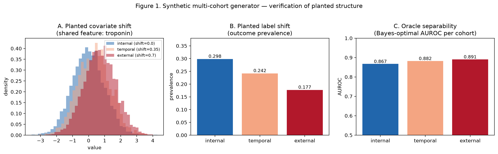
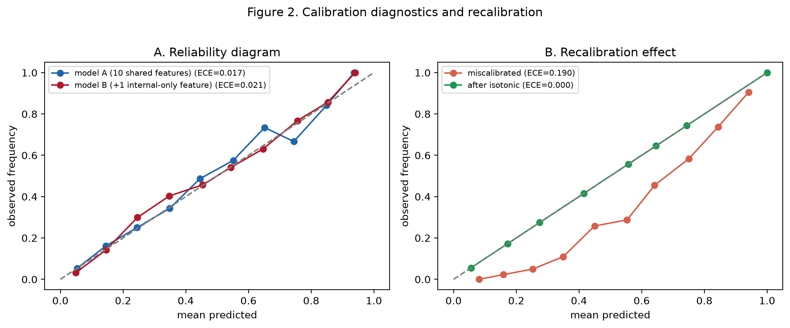
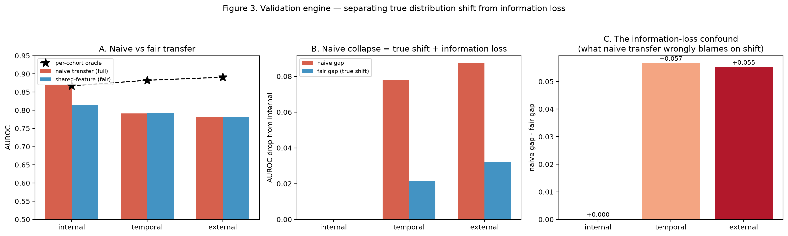
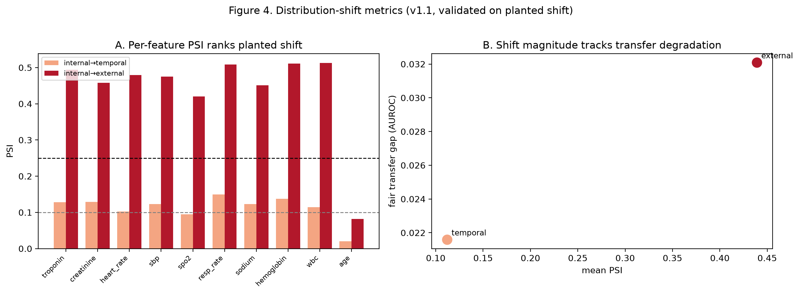
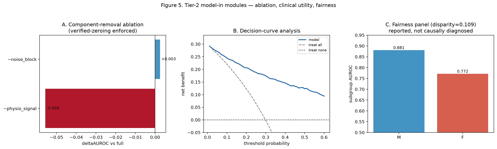
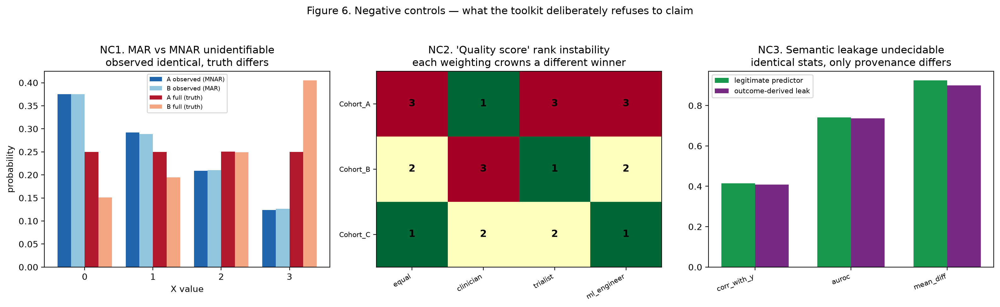

# cmvt — clinical-model-validation-toolkit

[](https://github.com/ahmedfawaz879/clinical-model-validation-toolkit/actions/workflows/ci.yml)
[](#reproducing-every-number)
[](pyproject.toml)
[](LICENSE)

A reproducible, **synthetic-first** validation harness for clinical prediction
models — DeLong AUROC comparison, calibration, patient-level cluster bootstrap,
distribution-shift metrics, decidable data-integrity checks, and a validation
engine that separates *true distribution shift* from *information loss*. Every
statistic is checked against an independent reference; the toolkit's most
distinctive feature is what it **refuses** to compute.

## The problem

External validation of a clinical model is almost always reported as a single
number: AUROC fell from X internally to Y externally. That number is a
**confound**. Some of the drop is genuine distribution shift — the patients or
the feature→outcome relationship differ across sites. Some of it is
**information loss** — the external site simply never recorded some of the
features the model was trained on, so at deployment they get silently
zero-imputed, discarding real predictive signal. A model can look like it "doesn't
generalise" when the real story is that it was evaluated on a smaller feature set.
`cmvt`'s validation engine (`cmvt.engine`) separates the two: it retrains on the
intersection of what every cohort actually records and compares that "fair"
transfer gap against the naive full-feature one, isolating the information-loss
confound as its own reported number.

## Install + 60-second quickstart

```bash
git clone https://github.com/ahmedfawaz879/clinical-model-validation-toolkit.git
cd clinical-model-validation-toolkit
pip install -e ".[dev]"
cmvt-demo
```

This builds the bundled three-cohort synthetic hierarchy (internal / temporal /
external, ~12,000 patients total, no external data or network access), runs the
full validation engine, and writes `reports/validation_report.md` — the report
excerpted in the figures below. It takes well under a minute on a laptop.

To run the test suite (92 tests, reference-agreement assertions, property tests,
guard tests, and the negative controls) and regenerate the six figures below:

```bash
pytest                            # full suite, ~90% coverage on cmvt.metrics/calibration/uncertainty/engine
python scripts/generate_figures.py  # writes docs/figures/*.png at 200 dpi, deterministic (seed=42)
```

## What this toolkit refuses to claim

A rigour tool is defined as much by what it declines to output as by what it
computes. `cmvt` ships three demonstrations — on data where the ground truth is
known by construction — of quantities a more "ambitious" toolkit might advertise
but that are **provably not identifiable** from the data available. Each is a
feature this toolkit deliberately does not ship; `tests/test_negative_controls.py`
ports all three as executable proofs, not just prose.

- **No MNAR-likelihood score.** Whether missing data are Missing-At-Random or
  Missing-Not-At-Random is *unidentifiable* from observed data alone — it is a
  theorem, not an implementation gap. `cmvt` constructs two datasets with
  identical observed distributions but different full-data truth (one MNAR, one
  MAR) to prove it, then ships `cmvt.integrity.littles_mcar_test` (which only
  tests MCAR-vs-not) and stops there.
- **No composite "dataset quality" score.** Collapsing completeness, balance,
  size, and shift-freedom into one number hides the weights inside it. Four
  equally defensible weightings crown **three different** "best" datasets out of
  three candidates — the score encodes the author's priorities, not a property of
  the data. `cmvt` reports the sub-metrics and refuses to rank them.
- **No values-only leakage score.** A "leakage detector" that flags
  outcome-derived columns from their values alone is claiming to distinguish a
  legitimate predictor from a label-derived leak using only statistics. `cmvt`
  constructs two columns with identical correlation, AUROC, and mean difference
  against the outcome — one legitimate, one an outcome-derived leak — and shows
  they are statistically indistinguishable. Only *provenance* (how the column was
  computed) resolves it, and provenance isn't in the data. `cmvt.integrity.leakage_scan`
  therefore ships only decidable checks: patient overlap across splits, duplicate
  IDs, post-cutoff rows, and a feature literally identical to the label.

The same discipline extends to `cmvt.tier2.fairness_panel`, which reports
max–min subgroup disparities but does not diagnose their cause (labelling,
sampling, physiology, and model bias are all consistent with the same numbers),
and to `cmvt.integrity.ExclusionTracker`, which records cohort composition at
every filtering step but issues no verdict on whether an exclusion is
appropriate — that is a clinical judgement, not a value computation.

## Tier 1 vs Tier 2

| | Needs | Modules |
|---|---|---|
| **Tier 1** — predictions-in | only `(y_true, y_prob)` per cohort, as columns in a CSV | `cmvt.metrics`, `cmvt.calibration`, `cmvt.uncertainty`, `cmvt.engine`, `cmvt.shift`, `cmvt.integrity` |
| **Tier 2** — model-in | a framework-neutral `fit(X, y)` / `predict_proba(X)` callable + a feature table | `cmvt.tier2` (ablation, decision-curve analysis, fairness panel) |

Tier 1 is runnable by anyone holding a table of predictions — no model, no
private data. Tier 2 unlocks component-removal ablation (with a
**verified-zeroing guard**: it asserts the "removed" columns are actually absent
from the design matrix before trusting the effect — a direct lesson from a
caught failure where a broken ablation silently reported a null effect),
decision-curve analysis, and the fairness panel, but requires the user to wire in
their own estimator.

## Figures

All six are produced by `scripts/generate_figures.py` on the bundled synthetic
cohorts (seed 42) — they are never hand-edited; regenerating them is the only way
they change.

### Figure 1 — Synthetic multi-cohort generator

Verifies the three planted structures the rest of the toolkit is exercised
against: (A) covariate shift on a shared feature growing internal→temporal→external,
(B) label (prevalence) shift in the same direction, and (C) that the
Bayes-optimal AUROC stays roughly flat across cohorts — the task is equally
learnable everywhere, so any gap a *trained* model shows is transfer failure, not
differing difficulty.

### Figure 2 — Calibration diagnostics and recalibration

(A) Reliability diagrams for two models that differ by one feature — a real,
DeLong-significant difference that is nonetheless *negligible* in magnitude,
this toolkit's central methodological caution. (B) Isotonic recalibration
applied to a deliberately miscalibrated score, showing the monotone
non-worsening property validated in `tests/test_calibration.py`.

### Figure 3 — The validation engine

The flagship result. (A) Naive (full-feature, zero-imputed) vs fair
(shared-feature) transfer AUROC against the per-cohort oracle. (B) The naive
AUROC drop from internal decomposes into a much smaller "fair" (true-shift) drop.
(C) The isolated information-loss confound — what naive transfer wrongly blames
on distribution shift — is positive and substantial for both temporal and
external cohorts.

### Figure 4 — Distribution-shift metrics

(A) Per-feature Population Stability Index correctly ranks the planted shift
magnitude (internal→temporal < internal→external) for every shared feature. (B)
Mean PSI tracks the fair transfer-gap from Figure 3 — shift magnitude predicts
transfer degradation.

### Figure 5 — Tier-2 model-in modules

(A) Component-removal ablation with the verified-zeroing guard enforced: removing
the physiological-signal block costs real AUROC, removing a noise block costs
~nothing. (B) Decision-curve analysis: net benefit of the model vs treat-all/treat-none.
(C) The fairness panel surfaces a planted subgroup disparity — reported, with no
cause inferred.

### Figure 6 — Negative controls

The three demonstrations behind "What this toolkit refuses to claim," above: (NC1)
MAR and MNAR mechanisms produce identical observed marginals from different
full-data truth. (NC2) Four defensible weightings of the same four sub-metrics
crown three different "best" datasets. (NC3) A legitimate predictor and an
outcome-derived leak are statistically indistinguishable on every value-based
statistic.

## TRIPOD+AI mapping

`cmvt` maps its outputs to the applicable domains of the **TRIPOD+AI** reporting
guideline (Collins et al., BMJ 2024) for model validation and calibration.
Domain groupings below follow the guideline's structure; check exact item numbers
against the published checklist before using this table in a submission — the
same no-unverified-citation discipline documented in the References section of
the source notebook applies here.

| TRIPOD+AI domain | What it asks for | `cmvt` component |
|---|---|---|
| Source of data / participants | Cohort provenance, inclusion/exclusion | `cmvt.synthetic` (bundled), `cmvt.integrity.ExclusionTracker` |
| Missing data | How missingness was handled and characterised | `cmvt.integrity.missingness_report`, `littles_mcar_test` |
| Statistical analysis — discrimination | AUROC with uncertainty, comparison between models | `cmvt.metrics.delong_auc_var`, `compare_auc`, `cmvt.uncertainty.bootstrap_ci` |
| Statistical analysis — calibration | Calibration plot / ECE / Brier | `cmvt.metrics.reliability_table`, `expected_calibration_error`, `cmvt.calibration` |
| External validation | Performance across settings; shift characterisation | `cmvt.engine.validation_plan`, `cmvt.shift.shift_report` |
| Data integrity | Leakage, duplication, temporal-cutoff violations | `cmvt.integrity.leakage_scan` |
| Model updating | Recalibration when transporting to a new setting | `cmvt.calibration.recalibrate` |
| Clinical usefulness | Net benefit at clinically relevant thresholds | `cmvt.tier2.decision_curve` |
| Fairness / equity (AI extension) | Subgroup performance disparities | `cmvt.tier2.fairness_panel` |
| Limitations | What was not, and cannot be, established | "What this toolkit refuses to claim," above |

Related standards referenced by the source notebook, applicable by design stage:
**PROBAST-AI** (risk of bias), **SPIRIT-AI** (protocol), **CONSORT-AI** (trial),
**STARD-AI** (diagnostic accuracy), **CHEERS-AI** (decision-analytic / economic).

## Reproducing every number

Every number and figure in this README is produced by the installed package on
the bundled synthetic data — there is no private or credentialed dataset
anywhere in this repository. `pytest` converts the source notebook's
reference-agreement audit into real assertions:

- DeLong AUROC point estimate vs `sklearn.metrics.roc_auc_score` (exact agreement).
- DeLong standard error vs the closed-form Hanley–McNeil approximation.
- Bootstrap standard error of the AUROC vs the analytic DeLong standard error.
- ECE of a constant predictor `c` equals `|c - mean(y)|` exactly (closed form).
- Decision-curve net benefit of a perfect model equals prevalence at every threshold.
- PSI ranks the planted shift: `0 < psi(internal, temporal) < psi(internal, external)`.
- The validation engine recovers a monotone transfer gap: `internal < temporal < external`.
- Self-comparison (an AUROC "compared" against itself) raises, rather than
  silently returning a degenerate p-value.
- The ablation runner's verified-zeroing guard raises if a "removed" component's
  columns are not actually absent from the design matrix.
- The three negative controls of Section 6 (MAR/MNAR unidentifiability,
  quality-score rank instability, undecidable semantic leakage) are ported
  verbatim as assertions.

CI (`.github/workflows/ci.yml`) runs this suite on Python 3.10/3.11/3.12 on every
push, plus `ruff` and `mypy`.

## What cannot be redistributed

MIMIC-IV, MIMIC-III, and eICU-CRD are credentialed-access PhysioNet datasets and
**must not**, and do not, ship with this repository. `cmvt.synthetic` reproduces
the *structural properties* those cohorts exhibit — feature-availability
differences and covariate/label/concept shift — with a fully synthetic generator,
so every documented command in this README runs on data the repository is
allowed to contain. Point the same API at your own cohorts by supplying the
CSVs (Tier 1) or `fit`/`predict_proba` callable (Tier 2) described above; no
toolkit code contains, or requires, protected data.

## Repository layout

```
clinical-model-validation-toolkit/
├── pyproject.toml                     # src-layout, pip install -e ., Python >=3.10
├── src/cmvt/
│   ├── synthetic.py                   # three-cohort generator with planted shift
│   ├── metrics.py                     # DeLong AUROC, McNemar, ECE, self-comparison guard
│   ├── calibration.py                 # reliability decomposition, isotonic/Platt recalibration
│   ├── uncertainty.py                 # patient-level cluster bootstrap, multi-seed runner
│   ├── engine.py                      # CohortRegistry, validation_plan (flagship)
│   ├── shift.py                       # PSI, KL, Wasserstein, energy, MMD
│   ├── integrity.py                   # leakage_scan, ExclusionTracker, MCAR test
│   ├── tier2.py                       # ablation_runner, decision_curve, fairness_panel
│   ├── report.py                      # build_validation_report
│   └── cli.py                         # `cmvt-demo` entry point
├── tests/                             # 92 tests incl. reference-agreement, property, guard, negative-control
├── scripts/generate_figures.py        # the only source of docs/figures/*.png
├── examples/run_synthetic_demo.py     # same pipeline as `cmvt-demo`, run directly
├── docs/figures/                      # the six PNGs embedded above
└── .github/workflows/                 # ci.yml (tests/lint/typecheck)
```

## Citation

If this toolkit is useful in your work, please cite it — see [`CITATION.cff`](CITATION.cff).
The validation *workflow* (the three-tier internal/temporal/external hierarchy,
multi-seed variance reporting, the significant-but-negligible caution, the
verified-zeroing ablation guard, and the negative-controls discipline) is drawn
from the author's MBBCh thesis (Port Said University, expected October 2026);
individual method citations (DeLong, Hanley–McNeil, TRIPOD+AI, etc.) are in the
source notebook's References section and preserved as docstring citations
throughout `src/cmvt/`.

## Licence

MIT — see [`LICENSE`](LICENSE). The licence covers this repository's source code
only; it does not cover, and does not grant rights to, any third-party clinical
dataset (see "What cannot be redistributed," above).
